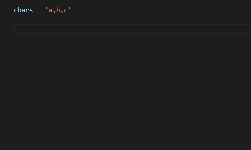

# VS Code Solargraph Extension

Solargraph is a language server that provides intellisense, code completion, and inline documentation for Ruby.

## Features

* Context-aware suggestions and documentation for the Ruby core
* Detection of some variable types and method return values (e.g., `String.new.` returns String instance methods)
* Identification of local, class, and instance variables within the current scope
* Find references and rename symbols (experimental as of solargraph gem v0.22.0)
* Support for gems
* Near-complete support for the Ruby core and stdlib
* Partial support for Ruby on Rails

## Requirements

You need to install the Ruby gem:

    gem install solargraph

## Usage

### Code Completion

Open a Ruby file and start typing. Solargraph should start providing contextual code suggestions. To start a search manually, hit ctrl-space. Example:

    Stri # <- Hitting ctrl-space here will suggest String

Method arguments and documentation can be seen by starting parentheses after the method call. Example:

    String.new.casecmp( # <- Displays arguments and documentation for String#casecmp

### Documentation

Solargraph provides a command to access searchable documentation directly from the IDE.

* Hit ctrl+shift+r (or hit ctrl+shift+p and find `Search Ruby Documentation`).
* Enter a keyword or path to search; e.g., `String` or `Array#join`.

The documentation includes the Ruby core, required gems, and the current workspace. Documentation from the workspace is automatically updated when you save the corresponding file.

You can also hover over variables, constants, and method calls to see popup information with links to more documentation.

#### Documenting Your Code

Using [YARD](http://www.rubydoc.info/gems/yard/file/docs/GettingStarted.md) for inline documentation is highly recommended.
Solargraph will use YARD comments to provide the best code completion and API reference it can.

In addition to the standard YARD tags, Solargraph defines a `@type` tag for documenting variable types. It works with both
local and instance variables. Example:

    # @type [String]
    my_variable = some_method_call
    my_variable. # <= Hitting crtl-space here will suggest String instance methods

### Intellisense

Solargraph also provides hovers and go to definition.

Hover your mouse over code to see method definitions, return values, and links to documentation.

To go to a method or variable's definition, right-click and select "Go to Definition" from the context menu, or press F12 for the definition at the cursor.

### Gem Support

Solargraph is capable of providing code completion and documentation for gems. When your code uses `require` to include a gem, its classes and methods become available in completion and intellisense.

You can make sure your gems are available with the commands `Build new gem documentation` or `Rebuild all gem documentation` in the command palette.

### Solargraph and Bundler

If your project uses Bundler, the most comprehensive way to use your bundled gems is to bundle Solargraph.

In the Gemfile:

    gem 'solargraph', group: :development

Run `bundle install` and use `bundle exec yard gems` to generate the documentation. This process documents cached or vendored gems, or even gems that are installed from a local path.

In order to access intellisense for bundled gems, you'll need to start the language server with Bundler by setting the `solargraph.useBundler` option to `true`.

### Diagnostics (Linting)

To enable diagnostics, set the `solargraph.diagnostics` configuration to `true`.

Solargraph uses RuboCop for diagnostics by default. If your project has a .solargraph.yml file, you can configure the diagnostics in its `reporters` section. Example:

    reporters:
    - rubocop

See [the configuration guide](https://solargraph.org/guides/configuration) for more information about the .solargraph.yml file.

Use a .rubocop.yml file in your project's root folder to customize the linting rules.

### Restarting Solargraph

Some changes you make to a project, such as updating the Gemfile, might require you to restart the Solargraph server.
Instead of reloading the VS Code window, you can run Restart Solargraph from the Command Palette.

### Project Configuration

Solargraph will use the .solargraph.yml file for configuration if it exists in the workspace root. The extension provides
a command to `Create a Solargraph config file`, or you can do it from the command line:

    $ solargraph config .

The default file should look something like this:

    include:
      - ./**/*.rb
    exclude:
      - spec/**/*

This configuration tells Solargraph to parse all .rb files in the workspace excluding the spec folder.

## Updating the Core Documentation

The Solargraph gem ships with documentation for Ruby 2.2.2. As of gem version 0.15.0, there's an option to download additional documentation for other Ruby versions from the command line.

    $ solargraph list-cores      # List the installed documentation versions
    $ solargraph available-cores # List the versions available for download
    $ solargraph download-core   # Install the best match for your Ruby version
    $ solargraph clear-cores     # Clear the documentation cache

## Extension Settings

This extension contributes the following settings:

* `solargraph.commandPath`: Path to the solargraph command.  Set this to an absolute path to select from multiple installed Ruby versions.
* `solargraph.useBundler`: Use `bundle exec` to run solargraph. (If this is true, `solargraph.commandPath` is ignored.)
* `solargraph.bundlerPath`: Path to the bundle command.
* `solargraph.checkGemVersion`: Check if a new version of the Solargraph gem is available. Default is true (recommended).
* `solargraph.diagnostics`: Enable diagnostics reporting. See [the configuration guide](https://solargraph.org/guides/configuration) for diagnostics options.
* `solargraph.completion`: Enable autocompletion.
* `solargraph.hover`: Enable tips on hover.
* `solargraph.autoformat`: Enable automatic formatting while typing.
* `solargraph.formatting`: Enable document formatting. The gem currently uses RuboCop for formatting.
* `solargraph.symbols`: Enable search for document and workspace symbols.
* `solargraph.definitions`: Enable go-to-definition.
* `solargraph.rename`: Enable symbol renaming.
* `solargraph.references`: Enable finding references.
* `solargraph.folding`: Enable folding ranges.
* `solargraph.transport`: socket (default), stdio, or external. See [Transport Options](#transport-options) for more information.
* `solargraph.externalServer`: The host and port for external transports. See [Transport Options](#transport-options) for more information.
* `solargraph.logLevel`: The logging level. Options in ascending amount of detail are `warn`, `info`, and `debug`. The default is `warn`.

## Transport Options

Extension version 0.18.0 introduces the `solargraph.transport` setting with the following options:

* `socket`: Run a TCP server. This is the default option.
* `stdio`: Run a STDIO server.
* `external`: Connect to an external server instead of starting a new one.

Most users should use the default `socket` option or switch to `stdio` in case of network issues.

The `external` option is intended for cases where the project is hosted in a different environment from the editor,
such as a docker container or a remote server. Users can opt to run a socket server in the remote environment and connect
to it via TCP. Example configuration:

    "solargraph.transport": "external",
    "solargraph.externalServer": {
        "host": "localhost",
        "port": 7658
    }

## More Information

See the [Solargraph website](https://solargraph.org) for guides, tips, and updates.

## Known Issues

* Partial support for Rails (see [https://solargraph.org/guides/rails](https://solargraph.org/guides/rails))
* Documentation pages need better design/layout
