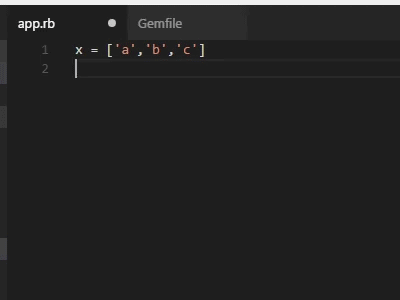

# VS Code Solargraph Extension

Solargraph provides code completion and inline documentation for Ruby.

*This project is still in early development.* Expect bugs and breaking changes.

## Features

* Context-aware suggestions and documentation for the Ruby core
* Detection of some variable types and method return values (e.g., `String.new.` returns String instance methods)
* Identification of local, class, and instance variables within the current scope

## Requirements

You need to install the Ruby gem:

    gem install solargraph

## Usage

### Code Completion

Open a Ruby file and start typing. Solargraph should start providing contextual code suggestions. To start a search manually, hit ctrl-space. Example:

    Stri # <- Hitting ctrl-space here will suggest String

### Documentation

Solargraph provides a command to access searchable documentation directly from the IDE.

* Hit ctrl+shift+r (or hit ctrl+shift+p and find `Search Ruby Documentation`).
* Enter a keyword or path to search; e.g., `String` or `Array#join`.

The documentation includes the Ruby core, bundled gems, and the current workspace.

#### Documenting Your Code

Using [YARD](http://www.rubydoc.info/gems/yard/file/docs/GettingStarted.md) for inline documentation is highly recommended.
Solargraph will use YARD comments to provide the best code completion and API reference it can.

In addition to the standard YARD tags, Solargraph defines a `@type` tag for documenting variable types. It works with both
local and instance variables. Example:

    # @type [String]
    my_variable = some_method_call
    my_variable. # <= Hitting crtl-space here will suggest String instance methods

## Extension Settings

This extension contributes the following settings:

* `solargraph.commandPath`: Path to the solargraph command.  Set this to an absolute path to select from multiple installed Ruby versions.
* `solargraph.useBundler`: Use `bundle exec` to run solargraph. (If this is true, `solargraph.commandPath` is ignored.)
* `solargraph.useServer`: Run solargraph server for better performance. Defaults to true as of version 0.1.0.
* `solargraph.serverPort`: The port where the server runs. Default is 0 (select the next available port).
* `solargraph.withSnippets`: Include snippets in completion suggestions. Default is false.

## Known Issues

* Incomplete support for stdlib
* Incomplete support for Rails
